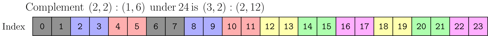
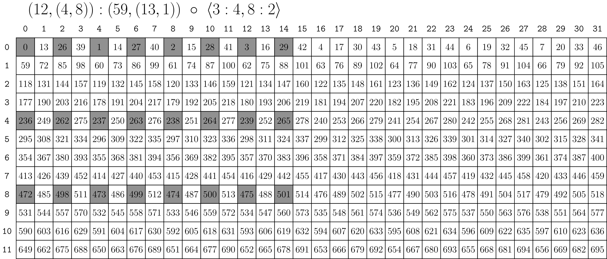
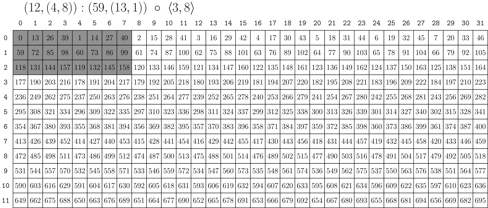
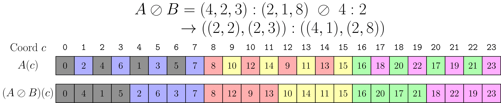
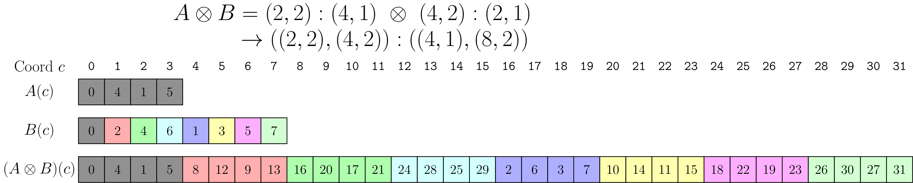
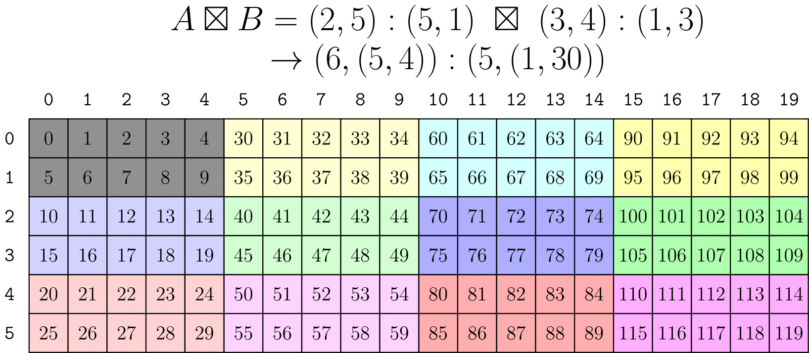

# CuTe布局核心操作详解

> 来源：Categorical Foundations for CuTe Layouts + NVIDIA CUTLASS 官方文档
> 作者：Colfax Research + NVIDIA
> 日期：2025年9月 | 更新：2025年12月

---

## 目录

1. [合并 (Coalesce)](#1-合并-coalesce)
2. [相对合并 (Relative Coalesce)](#2-相对合并-relative-coalesce)
3. [补集 (Complements)](#3-补集-complements)
4. [组合 (Composition)](#4-组合-composition)
5. [逻辑除法 (Logical Division)](#5-逻辑除法-logical-division)
6. [逻辑乘积 (Logical Product)](#6-逻辑乘积-logical-product)
7. [操作总结](#7-操作总结)

---

## 1. 合并 (Coalesce)

### 1.1 基本概念

**合并操作**的目的是简化布局，产生具有相同布局函数的最小复杂度布局。

从函数的角度看：**布局是从整数到整数的函数**。`coalesce` 操作是对这类函数的"简化"——如果我们只关心输入整数，那么可以在不改变函数的情况下操纵布局的形状和模式数量。唯一不能改变的是布局的 `size`（大小）。

### 1.2 后置条件

```cpp
// @post size(result) == size(layout)
// @post depth(result) <= 1
// @post for all i, 0 <= i < size(layout), result(i) == layout(i)
Layout coalesce(Layout const& layout)
```

**说明**：
- 结果的大小与原布局相同
- 结果的深度不超过 1（扁平化）
- 对于所有索引，结果函数与原布局函数相同

### 1.3 四种合并规则

对于两个整数模式 `s0:d0` 和 `s1:d1`，记合并结果为 `s0:d0 ++ s1:d1`。存在以下四种情况：

| 情况 | 条件 | 结果 | 说明 |
|------|------|------|------|
| **1** | `s0:d0 ++ _1:d1` | `s0:d0` | 忽略大小为1的模式 |
| **2** | `_1:d0 ++ s1:d1` | `s1:d1` | 忽略大小为1的模式 |
| **3** | `s0:d0 ++ s1:s0*d0` | `s0*s1:d0` | 第二模式步幅=第一模式大小×步幅，可合并 |
| **4** | `s0:d0 ++ s1:d1` | `(s0,s1):(d0,d1)` | 其他情况，保持分离 |

### 1.4 C++ 示例

```cpp
// 示例 1：基本合并
auto layout = Layout<Shape<_2,Shape<_1,_6>>,
                     Stride<_1,Stride<_6,_2>>>{};
auto result = coalesce(layout);    // _12:_1
```

**图示说明**：
```
原始布局: (2,(1,6)):(1,(6,2))
合并后:   12:1
```

### 1.5 数学定义与构造

**定义 2.3.3.1** 假设 L 是一个布局。如果满足以下条件之一，我们称 L 是**已合并的**：

1. `L = 1 : 0`
2. `depth(L) = 0` 且 `shape(L) > 1`
3. `depth(L) = 1`，`rank(L) > 1`，且 L 在扁平意义下是已合并的

**构造 2.3.3.7** 假设 L 是一个布局，并写出：
```
coal(L♭) = (s1, ..., sm) : (d1, ..., dm)
```

| 条件 | 结果 |
|------|------|
| m > 1 | `coal(L) = coal(L♭)` |
| m = 1 | `coal(L) = s1 : d1` |
| m = 0 | `coal(L) = 1 : 0` |

### 1.6 示例表格

| 原始布局 L | 合并后 coal(L) |
|-----------|---------------|
| `E = () : ()` | `1 : 0` |
| `(1, 1) : (2, 4)` | `1 : 0` |
| `(512) : (4)` | `512 : 4` |
| `(2, 2, 2) : (1, 2, 4)` | `8 : 1` |
| `((2, 2, 2),(5, 5)) : ((1, 2, 4),(10, 50))` | `(8, 25) : (1, 10)` |
| `(_2,Shape<_1,_6>):(_1,Stride<_6,_2>)` | `_12:_1` |

### 1.7 重要性质

**命题 2.3.3.14** 如果 A 和 B 是布局，那么：
```
ΦA = ΦB ⇔ coal(A) = coal(B)
```

**命题 2.3.3.16** 如果 L 是一个布局且 `size(L) > 1`，那么 `coal(L)` 是具有布局函数 ΦL 的**唯一复杂度最小化布局**。

### 1.8 按模式合并 (By-mode Coalesce)

有时我们关心布局的形状，但仍希望进行合并。例如：有一个 2-D 布局，希望结果保持 2-D。

```cpp
// 在 trg_profile 的终端应用 coalesce
Layout coalesce(Layout const& layout, IntTuple const& trg_profile)
```

**C++ 示例**：
```cpp
auto a = Layout<Shape<_2,Shape<_1,_6>>,
                Stride<_1,Stride<_6,_2>>>{};
auto result = coalesce(a, Step<_1,_1>{});   // (_2,_6):(_1,_2)

// 等价于
auto same_r = make_layout(coalesce(layout<0>(a)),
                          coalesce(layout<1>(a)));
```

**说明**：此函数递归进入 `Step<_1,_1>{}`，每当看到整数（而非元组）时，就对相应的子布局应用 `coalesce`。

> **主题**：定义一个将布局视为"1-D"整数到整数函数的操作，然后推广到任意形状的布局，这将是一个常见的模式！

---

## 2. 相对合并 (Relative Coalesce)

### 2.1 基本概念

**相对合并**操作 `coal(L, S̄)` 在简化布局的同时，确保结果形状仍然细化给定的嵌套元组 S̄。

### 2.2 定义

**定义 2.3.4.7（相对合并）** 假设 `L = S : D` 是一个布局，假设 S̄ 是某个长度为 m 且剖面为 P 的嵌套元组，它被 S 细化。我们定义：
```
coal(L, S̄) = (coal(L1), ..., coal(Lm))P
```
其中 `Li = modei(L, S̄)` 是 L 相对于 S̄ 的第 i 个模式。

### 2.3 重要性质

**引理 2.3.4.9** 如果 `L = S : D` 是一个布局且 S 细化 S̄，那么：
```
Φcoal(L,S̄) = ΦL
```

**命题 2.3.4.10** 假设 A 和 B 是布局，S̄ 是嵌套元组，使得 shape(A) 和 shape(B) 都细化 S̄。那么：
```
ΦA = ΦB ⇔ coal(A, S̄) = coal(B, S̄)
```

---

## 3. 补集 (Complements)

### 3.1 基本概念

**补集**操作找到一个与给定布局组合后形成紧凑布局的另一个布局。

可以将 `composition` 视为布局 B 从另一个布局 A 中"选择"某些坐标。那么没有被"选择"的坐标呢？为了实现通用平铺，我们希望能够选择任意元素（即**tile**），并描述这些 tile 的布局（即**剩余部分**或"rest"）。

补集操作试图找到另一个布局来表示"rest"——未被布局触及的元素。

### 3.2 定义

**定义 2.3.6.1** 假设 A 和 B 是布局。我们称 B 是 A 的**补集**，记作 `A ⊥ B`，如果连接的布局 `(A, B)` 是紧凑的。

**定义 2.3.6.7** 假设 A 是一个布局，N 是一个正整数。我们称布局 B 是 A 的**N-补集**，如果：
- `A ⊥ B`，且
- `size(A) · size(B) = N`

### 3.3 后置条件

```cpp
// @post cosize(make_layout(layout_a, result))) >= size(cotarget)
// @post cosize(result) >= round_up(size(cotarget), cosize(layout_a))
// @post for all i, 1 <= i < size(result), result(i-1) < result(i)
// @post for all i, 1 <= i < size(result),
//         for all j, 0 <= j < size(layout_a),
//           result(i) != layout_a(j)
Layout complement(LayoutA const& layout_a, Shape const& cotarget)
```

**补集 R 满足以下性质**：
1. **有界性**：R 的大小（和余大小）由 `size(cotarget)` 限定
2. **有序性**：R 的步幅为正且递增。这意味着 R 是唯一的
3. **不相交值域**：A 和 R 有不相交的值域。R 试图"完成"A 的值域

### 3.4 构造方法

**定义 2.3.6.5** 假设 A 是一个布局。如果 A 是可补的，那么：
```
comp(A) = coal(comp♭(A♭))
```

如果 N 是一个正整数且 A 是 N-可补的：
```
comp(A, N) = coal(comp♭(A♭, N))
```

### 3.5 补集示例

假设以下整数均为静态的（补集对静态形状和步幅最有效）：

| 布局 A | cotarget (N) | 结果 comp(A, N) | 说明 |
|--------|-------------|:---|-------------|
| `4:1` | 24 | `6:4` | `(4,6):(1,4)` 的余大小为 24，`4:1` 用 `6:4` 重复 6 次 |
| `6:4` | 24 | `4:1` | `(6,4):(4,1)` 的余大小为 24，`6:4` 中的"空洞"用 `4:1` 填充 |
| `(4,6):(1,4)` | 24 | `1:0` | 不需要附加任何内容 |
| `4:2` | 24 | `(2,3):(1,8)` | `(4,(2,3)):(2,(1,8))` 的余大小为 24 |
| `(2,4):(1,6)` | 24 | `3:2` | `((2,4),3):((1,6),2)` 的余大小为 24 |
| `((4,2),(2,2)):((3,24),(192,96))` | 768 | `(3,2,2,2):(1,12,48,384)` | 范畴论示例 |
| `((16,4),64):((1,16),64)` | 4096 | `1:0` | 无需补集 |
| `((16,4),64):((8,1),128)` | 16384 | `(2,2):(4,8192)` | 2-D 补集 |

### 3.6 图示说明

下图展示了最后一个示例的值域。原始布局 `(2,2):(1,6)` 的图像用灰色着色。补集有效地"重复"原始布局（用其他颜色显示），使得结果的值域大小为 24。补集 `(3,2):(2,12)` 可以视为"重复的布局"。



> **图解说明**：灰色区域表示原始布局 `(2,2):(1,6)` 的图像。其他颜色表示补集如何通过重复原始布局来填充值域至大小 24。补集 `(3,2):(2,12)` 可以理解为"重复的布局"。

### 3.7 重要性质

**命题 2.3.6.9** 假设 A 是一个布局。那么存在 A 的 N-补集**当且仅当** A 是 N-可补的。

**C++ 实现说明**：`cotarget` 参数最常见的是整数——实际上我们只使用 `size(cotarget)`。但有时指定一个具有静态属性的整数很有用。例如，`28` 是动态整数，而 `(_4,7)` 是大小为 `28` 的形状，且静态已知可被 `_4` 整除。两者在数学上产生相同的 `complement`，但额外信息可被 `complement` 用于尽可能保留结果的静态性。

---

## 4. 组合 (Composition)

### 4.1 基本概念

**组合**是布局最重要的操作，它将两个布局的布局函数进行复合。

布局的函数组合是 CuTe 的核心，几乎每个高级操作都使用它。

从布局只是整数到整数的函数这一观察出发，我们可以定义产生另一个布局的函数组合。

### 4.2 定义

**定义 2.3.7.1（布局的组合）** 假设 A 和 B 是布局。A 和 B 的**组合**是满足以下性质的唯一布局 `B ◦ A`：

1. `shape(B ◦ A)` 细化 `shape(A)`
2. `B ◦ A` 在 `shape(A)` 上是已合并的
3. `ΦB◦A = ΦB ◦ ΦsizeA(B)`

### 4.3 函数组合定义

```
函数组合，R := A o B
R(c) := (A o B)(c) := A(B(c))
```

**示例**：
```
A = (6,2):(8,2)
B = (4,3):(3,1)

R( 0) = A(B( 0)) = A(B(0,0)) = A( 0) = A(0,0) =  0
R( 1) = A(B( 1)) = A(B(1,0)) = A( 3) = A(3,0) = 24
R( 2) = A(B( 2)) = A(B(2,0)) = A( 6) = A(0,1) =  2
R( 3) = A(B( 3)) = A(B(3,0)) = A( 9) = A(3,1) = 26
R( 4) = A(B( 4)) = A(B(0,1)) = A( 1) = A(1,0) =  8
R( 5) = A(B( 5)) = A(B(1,1)) = A( 4) = A(4,0) = 32
R( 6) = A(B( 6)) = A(B(2,1)) = A( 7) = A(1,1) = 10
R( 7) = A(B( 7)) = A(B(3,1)) = A(10) = A(4,1) = 34
R( 8) = A(B( 8)) = A(B(0,2)) = A( 2) = A(2,0) = 16
R( 9) = A(B( 9)) = A(B(1,2)) = A( 5) = A(5,0) = 40
R(10) = A(B(10)) = A(B(2,2)) = A( 8) = A(2,1) = 18
R(11) = A(B(11)) = A(B(3,2)) = A(11) = A(5,1) = 42
```

**惊人的观察**：上述定义的函数 `R(c) = k` 可以写成另一个布局：
```
R = ((2,2),3):((24,2),8)
```

**并且满足**：
```
compatible(B, R)
```

即 B 的每个坐标也可以用作 R 的坐标。这是函数组合的预期属性，因为 B 定义了 R 的**定义域**。

### 4.4 后置条件

```cpp
// @post compatible(layout_b, result)
// @post for all i, 0 <= i < size(layout_b),
//        result(i) == layout_a(layout_b(i))
Layout composition(LayoutA const& layout_a, LayoutB const& layout_b)
```

### 4.5 存在条件

**注 2.3.7.2** 为了使 `B ◦ A` 存在，必须满足：
```
Image(ΦA) ⊆ [0, size(B))
```

### 4.6 计算组合

#### 观察与性质

- `B = (B_0, B_1, ...)`。布局可以表示为其子布局的连接
- `A o B = A o (B_0, B_1, ...) = (A o B_0, A o B_1, ...)`。当 B 是单射时，组合对连接满足**左分配律**

#### 整数情况

当 A 是整数布局 `A = a:b` 时，结果很简单：
```
R = A o B = a:b o s:d = s:(b*d)
```
结果 R 是 A 的前 s 个元素，步幅为 d。

#### 多模式情况

当 A 是多模式时，需要更小心。用文字描述：`A o B = A o s:d`（整数 s 和 d）意味着我们需要：

1. **确定一个布局，产生 A 的每第 d 个元素**

   这个中间布局的形状可以通过从左开始从 A 的形状中"除出"前 d 个元素来计算。

   **形状除法示例**：
   ```
   (6,2) /  2 => (3,2)
   (6,2) /  3 => (2,2)
   (6,2) /  6 => (1,2)
   (6,2) / 12 => (1,1)
   (3,6,2,8) /  3 => (1,6,2,8)
   (3,6,2,8) /  6 => (1,3,2,8)
   (3,6,2,8) /  9 => (1,2,2,8)
   (3,6,2,8) / 72 => (1,1,1,4)
   ```

   要计算跨步布局的步幅，使用上述操作的残差来缩放 A 的步幅。例如，最后一个示例 `(3,6,2,8):(w,x,y,z) / 72` 产生步幅 `(72*w,24*x,4*x,2*z)`。

   **步幅可除性条件**：注意我们只能用某些值除形状并获得合理结果。这称为**步幅可除性条件**，在 CuTe 中尽可能静态检查。

2. **保留新跨步 A 的前 s 个元素**，使结果具有与 B 兼容的形状

   这可以通过从左开始从 A 的形状中"模出"前 s 个元素来计算。

   **形状模运算示例**：
   ```
   (6,2) %  2 => (2,1)
   (6,2) %  3 => (3,1)
   (6,2) %  6 => (6,1)
   (6,2) % 12 => (6,2)
   (3,6,2,8) %  6 => (3,2,1,1)
   (3,6,2,8) %  9 => (3,3,1,1)
   (1,2,2,8) %  2 => (1,2,1,1)
   (1,2,2,8) % 16 => (1,2,2,4)
   ```

   此操作使结果具有与 B 兼容的形状。

   **形状可除性条件**：同样，此操作必须满足**形状可除性条件**才能产生合理结果，并在 CuTe 中尽可能静态检查。

#### 完整示例

从上述示例，我们可以构造组合：
```
(3,6,2,8):(w,x,y,z) o 16:9 = (1,2,2,4):(9*w,3*x,y,z)
```

### 4.7 工作示例

#### 示例 1：计算组合

```
函数组合，R := A o B
R(c) := (A o B)(c) := A(B(c))

示例：
A = (6,2):(8,2)
B = (4,3):(3,1)

1. 使用左分配律和连接属性：
R = A o B
  = (6,2):(8,2) o (4,3):(3,1)
  = ((6,2):(8,2) o 4:3, (6,2):(8,2) o 3:1)

1.1. 计算 (6,2):(8,2) o 4:3
- 首先计算跨步布局：(6,2):(8,2) / 3 = (2,2):(24,2)
- 然后保持形状兼容：(2,2):(24,2) % 4 = (2,2):(24,2)

1.2. 计算 (6,2):(8,2) o 3:1
- 首先计算跨步布局：(6,2):(8,2) / 1 = (6,2):(8,2)
- 然后保持形状兼容：(6,2):(8,2) % 3 = (3,1):(8,2)

组合在一起并合并每个模式：
R = A o B = ((2,2),3):((24,2),8)
```

#### 示例 2：重塑布局为矩阵（行主序）

```
20:2 o (5,4):(4,1)
这描述将布局 20:2 解释为 5x4 行主序矩阵。

1. = 20:2 o (5:4,4:1)     [将 (5,4):(4,1) 表示为子布局连接]
2. = (20:2 o 5:4, 20:2 o 4:1)  [左分配律]
   - 20:2 o 5:4  =>  5:8  [平凡情况]
   - 20:2 o 4:1  =>  4:2  [平凡情况]
3. = (5:8, 4:2)          [组合布局作为子布局连接]
4. = (5,4):(8,2)          [最终组合布局]
```

#### 示例 3：重塑布局为矩阵（列主序）

```
(10,2):(16,4) o (5,4):(1,5)
这描述将布局 (10,2):(16,4) 解释为 5x4 列主序矩阵。

1. = (10,2):(16,4) o (5:1,4:5)
2. = ((10,2):(16,4) o 5:1, (10,2):(16,4) o 4:5)
   - (10,2):(16,4) o 5:1 => (5,1):(16,4)  [模出形状 5]
   - (10,2):(16,4) o 4:5 => (2,2):(80,4)  [除出步幅 5]
3. = ((5,1):(16,4), (2,2):(80,4))
4. = (5:16, (2,2):(80,4))  [按模式合并]
5. = (5,(2,2))):(16,(80,4))  [最终组合布局]
```

**C++ 代码**（静态形状和步幅）：
```cpp
Layout a = make_layout(make_shape(Int<10>{}, Int<2>{}),
                       make_stride(Int<16>{}, Int<4>{}));
Layout b = make_layout(make_shape(Int< 5>{}, Int<4>{}),
                       make_stride(Int< 1>{}, Int<5>{}));
Layout c = composition(a, b);
print(c);  // 输出: (_5,(_2,_2)):(_16,(_80,_4))
```

**C++ 代码**（动态整数）：
```cpp
Layout a = make_layout(make_shape(10, 2),
                       make_stride(16, 4));
Layout b = make_layout(make_shape( 5, 4),
                       make_stride( 1, 5));
Layout c = composition(a, b);
print(c);  // 输出: ((5,1),(2,2)):((16,4),(80,4))
```

**注**：结果看起来不同但在数学上是相同的。形状中的 1 不影响布局作为 1-D 坐标到整数的函数，或作为 2-D 坐标到整数的函数。在动态情况下，CuTe 无法合并动态大小为 1 的模式来"简化"布局，因为包含它们的元组的静态秩和类型。

### 4.8 按模式组合 (By-mode Composition)

类似于按模式 `coalesce` 并构建通用平铺操作，有时我们关心 A 布局的形状，仍希望对单个模式应用 `composition`。

**Tiler 概念**：`composition` 的第二个参数 B 可以是 `Tiler`。通常，tiler 是布局或布局元组（注意对 `IntTuple` 的推广）。

```cpp
// (12,(4,8)):(59,(13,1))
auto a = make_layout(make_shape(12,make_shape(4,8)),
                     make_stride(59,make_stride(13,1)));
// <3:4, 8:2>
auto tiler = make_tile(Layout<_3,_4>{},  // 对模式-0 应用 3:4
                       Layout<_8,_2>{}); // 对模式-1 应用 8:2

// (_3,(2,4)):(236,(26,1))
auto result = composition(a, tiler);

// 等价于
auto same_r = make_layout(composition(layout<0>(a), get<0>(tiler)),
                          composition(layout<1>(a), get<1>(tiler)));
```

**符号说明**：我们经常使用 `<LayoutA, LayoutB, ...>` 符号来区分 `Tiler` 与之前使用的子布局连接符号 `(LayoutA, LayoutB, ...)`。



> **图解说明**：上述代码中的 `result` 可以描绘为原始布局中高亮显示的 3x8 子布局。灰色的方块表示被 tiler 选择的元素，它们形成一个 3x8 的子区域。

### 4.9 组合 Tiler (Composition Tilers)

**Tiler 是以下对象之一**：

1. **布局** (Layout)
2. **Tiler 的元组**
3. **形状** (Shape)，将被解释为步幅为 1 的布局元组

以上任何一种都可以用作 `composition` 的第二个参数。

**使用 Shape 作为 Tiler**：
```cpp
// (12,(4,8)):(59,(13,1))
auto a = make_layout(make_shape(12,make_shape(4,8)),
                     make_stride(59,make_stride(13,1)));
// (8, 3)
auto tiler = make_shape(Int<3>{}, Int<8>{});
// 等价于 <3:1, 8:1>

// (_3,(4,2)):(59,(13,1))
auto result = composition(a, tiler);
```



> **图解说明**：`result` 可以描绘为原始布局中高亮显示的 3x8 子布局。与上一张图不同，这里使用 Shape 作为 tiler，默认步幅为 1，产生不同的子布局选择模式。

**用途**：
- **按模式应用**：检索张量指定模式的任意子布局（"给我这个 MxNxL 张量的 3x5x8 子块"）
- **1-D 重塑**：将整个数据块重塑和重新排序，就像它们是 1-D 向量一样（"使用这个奇怪的元素顺序将这个 8x16 数据块重新排序为 32x4 块"）

### 4.10 重要性质

**命题 2.3.7.10** 假设 A 是布局，B 和 B̃ 满足：
- `size(B) ≤ size(B̃)`
- `ΦB̃ |size(B) = ΦB`

如果 A 和 B 是可组合的，那么：
```
B ◦ A = B̃ ◦ A
```

**推论 2.3.7.11** 如果 A 和 B 是布局：
```
A 和 B 可组合 ⇔ A 和 coal(B) 可组合
B ◦ A = coal(B) ◦ A
```

---

## 5. 逻辑除法 (Logical Division)

### 5.1 基本概念

**逻辑除法**用于将布局平铺成指定的块形状，允许使用 `(平铺坐标, 平铺内坐标)` 形式的索引。

非正式地，`logical_divide(A, B)` 将布局 A 分割成两个模式：
- **第一个模式**：B 指向的所有元素
- **第二个模式**：B 未指向的所有元素

### 5.2 定义

**定义 2.3.8.1** 假设 A 和 B 是布局，`Bc = comp(B, size(A))` 是 B 相对于 size(A) 的补集。那么 A 除以 B 的逻辑除法是：
```
A ⊘ B = A ◦ (B, Bc) = (A ◦ B, A ◦ Bc)
```

**C++ 实现**：
```cpp
template <class LShape, class LStride,
          class TShape, class TStride>
auto logical_divide(Layout<LShape,LStride> const& layout,
                    Layout<TShape,TStride> const& tiler)
{
  return composition(layout, make_layout(tiler, complement(tiler, size(layout))));
}
```

### 5.3 1-D 示例

考虑用平铺器 `B = 4:2` 平铺 1-D 布局 `A = (4,2,3):(2,1,8)`。

**计算步骤**：
1. `B = 4:2` 在 `size(A) = 24` 下的补集是 `B* = (2,3):(1,8)`
2. 连接 `(B,B*) = (4,(2,3)):(2,(1,8))`
3. `A = (4,2,3):(2,1,8)` 与 `(B,B*)` 的组合是 `((2,2),(2,3)):((4,1),(2,8))`



> **图解说明**：上图将 A 描绘为 1-D 布局，其中 B 指向的元素用灰色高亮显示。布局 B 描述我们的"数据平铺"，A 中有 6 个这样的平铺，用不同颜色显示。除法后，结果的第一个模式是数据平铺，第二个模式遍历每个平铺。

### 5.4 2-D 示例

使用上面定义的 `Tiler` 概念，这可以立即推广到多维平铺。

**示例**：考虑 2-D 布局 `A = (9,(4,8)):(59,(13,1))`，想要：
- 在列（模式-0）上应用 `3:3`
- 在行（模式-1）上应用 `(2,4):(1,8)`

平铺器可以写成 `B = <3:3, (2,4):(1,8)>`。


> **图解说明**：上图将 A 描绘为 2-D 布局，其中 B 指向的元素用灰色高亮显示。布局 B 描述我们的"数据平铺"，A 中有 12 个这样的平铺，用不同颜色显示。除法后，每个结果的第一个模式是数据平铺，第二个模式遍历每个平铺。注意第一个模式是子布局 `(3,(2,4)):(177,(13,2))`，这正是如果我们应用 `composition` 而不是 `logical_divide` 会得到的结果。

### 5.5 Zipped、Tiled、Flat 除法变体

虽然很容易在上图中看到平铺，但使用它们仍然很麻烦。如何切片出第 3 个平铺或第 7 个平铺或 `(1,2)` 第个平铺？

**便捷变体**：假设我们有一个布局和某个形状的 `Tiler`，每个操作都应用 `logical_divide`，但可能将模式重新排列成更方便的形式。

| 操作 | 结果形状格式 | 说明 |
|------|-------------|------|
| `logical_divide` | `((TileM,RestM), (TileN,RestN), L, ...)` | 保留模式语义 |
| `zipped_divide` | `((TileM,TileN), (RestM,RestN,L,...))` | 将"子平铺"收集到单个模式 |
| `tiled_divide` | `((TileM,TileN), RestM, RestN, L, ...)` | 分离平铺和剩余模式 |
| `flat_divide` | `(TileM, TileN, RestM, RestN, L, ...)` | 完全扁平化 |

**C++ 示例**：
```cpp
// A: shape is (9,32)
auto layout_a = make_layout(make_shape(Int<9>{}, make_shape(Int<4>{}, Int<8>{})),
                            make_stride(Int<59>{}, make_stride(Int<13>{}, Int<1>{})));
// B: shape is (3,8)
auto tiler = make_tile(Layout<_3,_3>{},           // 对模式-0 应用 3:3
                       Layout<Shape<_2,_4>,Stride<_1,_8>>{}); // 对模式-1 应用 (2,4):(1,8)

// ((TileM,RestM), (TileN,RestN)) with shape ((3,3), (8,4))
auto ld = logical_divide(layout_a, tiler);

// ((TileM,TileN), (RestM,RestN)) with shape ((3,8), (3,4))
auto zd = zipped_divide(layout_a, tiler);
```

**使用 zipped_divide**：
- 第 3 个平铺的偏移：`zd(0,3)`
- 第 7 个平铺的偏移：`zd(0,7)`
- `(1,2)` 第个平铺的偏移：`zd(0,make_coord(1,2))`
- 平铺本身的布局总是 `layout<0>(zd)`

**性质**：
```
layout<0>(zipped_divide(a, b)) == composition(a, b)
```

**语义区别**：
- `logical_divide` **保留模式的语义**，同时置换这些模式内的元素
- `zipped_divide` 的模式-0 是平铺本身（无论 Tiler 的秩是多少），模式-1 是这些平铺的布局

### 5.6 Zipped Divide 可视化


> **图解说明**：上图中我们保持每个平铺的颜色以清晰起见。显然，遍历平铺现在等价于遍历此布局的一行，遍历平铺内的元素等价于遍历此布局的一列。如我们将在 `Tensor` 部分看到的那样，这可以用于在数据平铺内或跨平铺分区中产生巨大效果。

### 5.7 重要说明

**注**：平铺的形状相同，但每个平铺的布局不同会导致不同的逻辑除法结果：
- 列主序平铺 → 产生列主序的 A ⊘ B
- 行主序平铺 → 产生行主序的 A ⊘ B

---

## 6. 逻辑乘积 (Logical Product)

### 6.1 基本概念

**逻辑乘积**使用补集扩展一个布局以组合另一个布局。

非正式地，`logical_product(A, B)` 产生一个双模式布局：
- **第一个模式**：布局 A
- **第二个模式**：布局 B，但每个元素被 A 的"唯一复制"替换

### 6.2 定义

**定义 2.3.9.1** 假设 A 和 B 是布局，`Ac = comp(A, size(A) · cosize(B))` 是 A 相对于 `size(A) · cosize(B)` 的补集。那么 A 和 B 的逻辑乘积是：
```
A ⊗ B = (A, Ac ◦ B)
```

**C++ 实现**：
```cpp
template <class LShape, class LStride,
          class TShape, class TStride>
auto logical_product(Layout<LShape,LStride> const& layout,
                     Layout<TShape,TStride> const& tiler)
{
  return make_layout(layout, composition(complement(layout, size(layout)*cosize(tiler)), tiler));
}
```

### 6.3 1-D 示例

考虑根据 `B = 6:1` 复制 1-D 布局 `A = (2,2):(4,1)`。

**计算步骤**：
1. `A = (2,2):(4,1)` 在 `6*4 = 24` 下的补集是 `A* = (2,3):(2,8)`
2. `A* = (2,3):(2,8)` 与 `B = 6:1` 的组合是 `(2,3):(2,8)`
3. 连接 `(A,A* o B) = ((2,2),(2,3)):((4,1),(2,8))`


> **图解说明**：上图将 A 和 B 描绘为 1-D 布局。布局 B 描述 A 的重复数量和顺序，为清晰起见着色。乘积后，结果的第一个模式是数据平铺，第二个模式遍历每个平铺。

> **注意**：结果与 1-D 逻辑除法示例的结果相同。

### 6.4 改变平铺顺序

当然，我们可以通过改变 B 来改变乘积中平铺的数量和顺序。

**示例**：`B = (4,2):(2,1)`



> **图解说明**：在上图中使用 `B = (4,2):(2,1)`，有 8 个重复的平铺而不是 6 个，并且平铺的顺序不同。

### 6.5 2-D 示例

我们可以使用之前开发的按模式 `tiler` 策略来编写多维乘积。


> **图解说明**：上图演示了使用 `tiler` 来应用按模式 `logical_product`。尽管这不是推荐方法，但结果是秩-2 布局，由 2x5 行主序块组成，平铺在 3x4 列主序排列中。

> **警告**：这不是推荐方法，因为上述表达式中的 tiler B 非常不直观。实际上，它需要完美了解 A 的形状和步幅才能构造。我们希望以某种方式表达"根据布局 B 平铺布局 A"，使 A 和 B 独立且更直观。

### 6.6 Blocked 和 Raked 乘积

**blocked_product(LayoutA, LayoutB)** 和 **raked_product(LayoutA, LayoutB)** 是 1-D `logical_product` 之上的秩敏感转换，让我们表达最常想要的最直观的布局乘积。

**关键观察**：`logical_product` 的兼容性后置条件：
```cpp
// @post rank(result) == 2
// @post compatible(layout_a, layout<0>(result))
// @post compatible(layout_b, layout<1>(result))
```

因为 A 总是与结果的模式-0 兼容，B 总是与结果的模式-1 兼容，如果我们使 A 和 B 具有相同的秩，那么我们可以在乘积后"重新关联"相同的模式。即，A 中的"列"模式可以与 B 中的"列"模式组合，A 中的"行"模式可以与 B 中的"行"模式组合，等等。

**这正是 blocked_product 和 raked_product 所做的**，这就是为什么它们被称为**秩敏感**的。

#### Blocked Product

```cpp
A = (2,5):(1,2)  [行主序]
B = (3,4):(1,3)  [列主序]

blocked_product(A, B) 的结果：
- 2x5 行主序块作为平铺
- 排列成 3x4 列主序
- 模式-0 自动合并
```



> **图解说明**：上图显示与 tiler 方法相同的结果，但使用更直观的参数。2x5 行主序布局排列为 3x4 列主序平铺。注意 `blocked_product` 为我们自动合并了模式-0。

#### Raked Product

`raked_product` 稍微不同地组合模式。结果的"列"模式不是从 A"列"模式然后 B"列"模式构造，而是从 B"列"模式然后 A"列"模式构造。

**结果**：平铺 A 现在与"平铺布局"B 交错或"耙状"，而不是作为块出现。其他参考称之为"循环分布"。


> **图解说明**：上图显示了 `raked_product` 如何以不同方式组合模式。平铺 A 现在以"耙状"或循环分布的方式与"平铺布局"B 交错，而不是作为连续块出现。

### 6.7 Zipped 和 Tiled 乘积

类似于 `zipped_divide` 和 `tiled_divide`，`zipped_product` 和 `tiled_product` 只是重新排列按模式 `logical_product` 产生的模式。

| 操作 | 结果形状格式 | 说明 |
|------|-------------|------|
| `logical_product` | `((M,TileM), (N,TileN), L, ...)` | 基础逻辑乘积 |
| `zipped_product` | `((M,N), (TileM,TileN,L,...))` | 压缩相同模式 |
| `tiled_product` | `((M,N), TileM, TileN, L, ...)` | 分离平铺 |
| `flat_product` | `(M, N, TileM, TileN, L, ...)` | 完全扁平化 |

### 6.8 示例表格

| A | B | A ⊗ B | 说明 |
|---|---|---|---|
| `(2, 2) : (5, 10)` | `(3, 5) : (5, 1)` | `((2, 2),(3, 5)) : ((5, 10),(20, 1))` | 基础逻辑乘积 |
| `(3, 3) : (6, 1)` | `(10, 12) : (24, 2)` | `((3, 3),(10, 12)) : ((6, 1),(216, 18))` | 更大形状 |
| `(2, 10) : (1680, 4)` | `(4, 9) : (2, 56)` | `((2, 10),((2, 2),(3, 3))) : ((1680, 4),((2, 40),(560, 3360)))` | 复杂嵌套 |

### 6.9 计算灵活性

**观察 2.3.9.2** 在计算 A ⊗ B 时，可以将 Ac 取为任何足够大的（已排序的）A 的补集。

---

## 7. 操作总结

### 7.1 操作对比表

| 操作名称 | 符号 | 输入 | 输出 | 主要用途 |
|---------|------|------|------|---------|
| **合并** | `coal(L)` | 布局 L | 简化的布局 | 移除冗余，最小化复杂度 |
| **相对合并** | `coal(L, S̄)` | 布局 L, 剖面 S̄ | 简化的布局 | 在保持对 S̄ 细化的同时简化 |
| **补集** | `comp(A, N)` | 布局 A, 大小 N | 补集布局 | 扩展布局以填充 N |
| **组合** | `B ◦ A` | 布局 A, B | 组合布局 | 复合两个布局的映射 |
| **逻辑除法** | `A ⊘ B` | 布局 A, B | 平铺布局 | 将 A 平铺成 B 的形状 |
| **逻辑乘积** | `A ⊗ B` | 布局 A, B | 扩展布局 | 扩展 A 以组合 B |

### 7.2 除法和乘积变体对比

| 变体 | logical_divide 结果 | zipped_divide 结果 | tiled_divide 结果 | flat_divide 结果 |
|------|---------------------|-------------------|-------------------|------------------|
| 输入 | `(M,N,L,...)` / `<TileM,TileN>` | `(M,N,L,...)` / `<TileM,TileN>` | `(M,N,L,...)` / `<TileM,TileN>` | `(M,N,L,...)` / `<TileM,TileN>` |
| 输出 | `((TileM,RestM),(TileN,RestN),L,...)` | `((TileM,TileN),(RestM,RestN,L,...))` | `((TileM,TileN),RestM,RestN,L,...)` | `(TileM,TileN,RestM,RestN,L,...)` |

| 变体 | logical_product 结果 | zipped_product 结果 | tiled_product 结果 | flat_product 结果 |
|------|---------------------|-------------------|-------------------|------------------|
| 输入 | `(M,N,L,...)` / `<TileM,TileN>` | `(M,N,L,...)` / `<TileM,TileN>` | `(M,N,L,...)` / `<TileM,TileN>` | `(M,N,L,...)` / `<TileM,TileN>` |
| 输出 | `((M,TileM),(N,TileN),L,...)` | `((M,N),(TileM,TileN,L,...))` | `((M,N),TileM,TileN,L,...)` | `(M,N,TileM,TileN,L,...)` |

### 7.3 关键关系

```
组合是最基础的操作：

逻辑除法：  A ⊘ B = A ◦ (B, comp(B, size(A)))
逻辑乘积：  A ⊗ B = (A, comp(A, size(A)·cosize(B)) ◦ B)
```

### 7.4 Python 实现参考

在 CUTLASS 的 CuTe DSL 中：

```python
# 合并
coal_A = cute.coalesce(A)
coal_A_over_S = cute.coalesce(A, target_profile=S)

# 补集
comp_A = cute.complement(A, N)

# 组合
B_compose_A = cute.composition(B, A)

# 逻辑除法
quotient = cute.logical_divide(A, B)

# 逻辑乘积
product = cute.logical_product(A, B)
```

### 7.5 C++ 实现参考

```cpp
// 合并
auto coal_a = coalesce(a);
auto coal_a_profile = coalesce(a, Step<_1,_1>{});

// 补集
auto comp_a = complement(a, 24);

// 组合
auto c = composition(a, b);

// 逻辑除法
auto ld = logical_divide(layout_a, tiler);
auto zd = zipped_divide(layout_a, tiler);
auto td = tiled_divide(layout_a, tiler);
auto fd = flat_divide(layout_a, tiler);

// 逻辑乘积
auto lp = logical_product(a, b);
auto bp = blocked_product(a, b);
auto rp = raked_product(a, b);
auto zp = zipped_product(a, b);
auto tp = tiled_product(a, b);
auto fp = flat_product(a, b);

// Tiler 创建
auto tiler = make_tile(Layout<_3,_4>{}, Layout<_8,_2>{});
```

### 7.6 范畴论实现

在论文的 `tract` 模块中：

```python
# 检查是否可处理
tract.is_tractable(L)

# 计算态射
f_L = tract.compute_morphism(L)

# 计算布局
L_f = tract.compute_layout(f)

# 组合
g_compose_f = tract.compose(f, g)

# 合并
coal_f = tract.coalesce(f)

# 补集
comp_f = tract.complement(f)

# 逻辑除法
quotient = tract.logical_divide(f, g)

# 逻辑乘积
product = tract.logical_product(f, g)
```

### 7.7 可除性条件总结

| 条件名称 | 说明 | 检查时机 |
|---------|------|---------|
| **步幅可除性条件** | 形状除法 `A / d` 产生合理结果 | 组合时 |
| **形状可除性条件** | 形状模运算 `A % s` 产生合理结果 | 组合时 |

**形状除法示例**：
```
(6,2) /  2 => (3,2)  ✓ 可除
(6,2) /  5 => ?      ✗ 不可除
```

**形状模运算示例**：
```
(6,2) %  4 => (6,2)  ✓ 兼容
(6,2) % 13 => ?      ✗ 不兼容
```

---

## 附录：术语对照表

| 英文 | 中文 | 英文 | 中文 |
|------|------|------|------|
| Layout | 布局 | Shape | 形状 |
| Stride | 步幅 | Coalesce | 合并 |
| Complement | 补集 | Composition | 组合/复合 |
| Logical Division | 逻辑除法 | Logical Product | 逻辑乘积 |
| Compact | 紧凑 | Non-degenerate | 非退化 |
| Tractable | 易处理 | Refine | 细化 |
| Profile | 剖面 | Mode | 模式 |
| Rank | 秩 | Depth | 深度 |
| Size | 大小 | Cosize | 余大小 |
| Tuple | 元组 | Nested Tuple | 嵌套元组 |
| Column-major | 列主序 | Row-major | 行主序 |
| Tiler | 平铺器 | Tile | 平铺/块 |
| Blocked Product | 块状乘积 | Raked Product | 耙状乘积 |
| Zipped Divide | 压缩除法 | Tiled Divide | 平铺除法 |
| Flat Divide | 扁平除法 | Zipped Product | 压缩乘积 |
| Codomain | 值域 | Domain | 定义域 |
| Divisibility Condition | 可除性条件 | Compatible | 兼容 |

---

## 附录：图片索引

本文档包含以下来自 NVIDIA CUTLASS 官方文档的示例图片：

| 图片 | 文件名 | 说明 |
|------|--------|------|
| 补集可视化 | `complement1.png` | 展示 `(2,2):(1,6)` 的补集如何填充值域至大小 24 |
| 按模式组合 | `composition1.png` | 展示 3x8 子布局的组合操作结果 |
| Shape 作为 Tiler | `composition2.png` | 展示使用 Shape 作为 tiler 的组合操作 |
| 1-D 逻辑除法 | `divide1.png` | 展示 1-D 布局的平铺操作，6 个彩色平铺 |
| 2-D 逻辑除法 | `divide2.png` | 展示 2-D 布局的平铺操作，12 个彩色平铺 |
| Zipped Divide | `divide3.png` | 展示 zipped_divide 的重新组织结果 |
| 1-D 逻辑乘积 | `product1.png` | 展示 1-D 逻辑乘积，6 个重复平铺 |
| 1-D 逻辑乘积（变体） | `product2.png` | 展示使用不同 B 的 1-D 逻辑乘积，8 个平铺 |
| 2-D 逻辑乘积 | `product2d.png` | 展示使用 tiler 的 2-D 逻辑乘积（非推荐） |
| Blocked Product | `productblocked2d.png` | 展示 blocked_product 的直观结果 |
| Raked Product | `productraked2d.png` | 展示 raked_product 的交错分布模式 |

所有图片保存在 `./images/` 目录中。

---

## 附录：NVIDIA CUTLASS 参考资料

> **文档说明**：本文档基于 NVIDIA CUTLASS 库中 CuTe 布局的数学理论，结合 Colfax Research 的范畴论框架形式化布局代数操作，并整合 NVIDIA CUTLASS 4.3.2 官方文档的 C++ 实现细节。适用于高性能 GPU 编程和深度学习框架开发。

### 官方文档链接

- **CuTe Layout Algebra**: https://docs.nvidia.com/cutlass/4.3.2/media/docs/cpp/cute/02_layout_algebra.html
- **Colfax Research 论文**: https://github.com/ColfaxResearch/layout-categories
- **CUTLASS GitHub**: https://github.com/NVIDIA/cutlass

### 核心概念总结

1. **布局作为函数**：布局是从整数到整数的函数
2. **组合是核心**：所有高级操作都依赖于函数组合
3. **补集实现平铺**：补集操作是实现通用平铺的关键
4. **除法和乘积**：用于数据分区和复制
5. **按模式操作**：支持多维布局的灵活操作
6. **Tiler 概念**：统一处理一维和多维平铺操作

### 性能优化要点

1. **静态形状和步幅**：尽可能使用编译期常量以获得最佳性能
2. **合并操作**：减少模式数量以简化坐标映射
3. **兼容性检查**：静态检查可除性条件
4. **秩敏感操作**：blocked/raked 乘积提供更直观的布局构造
